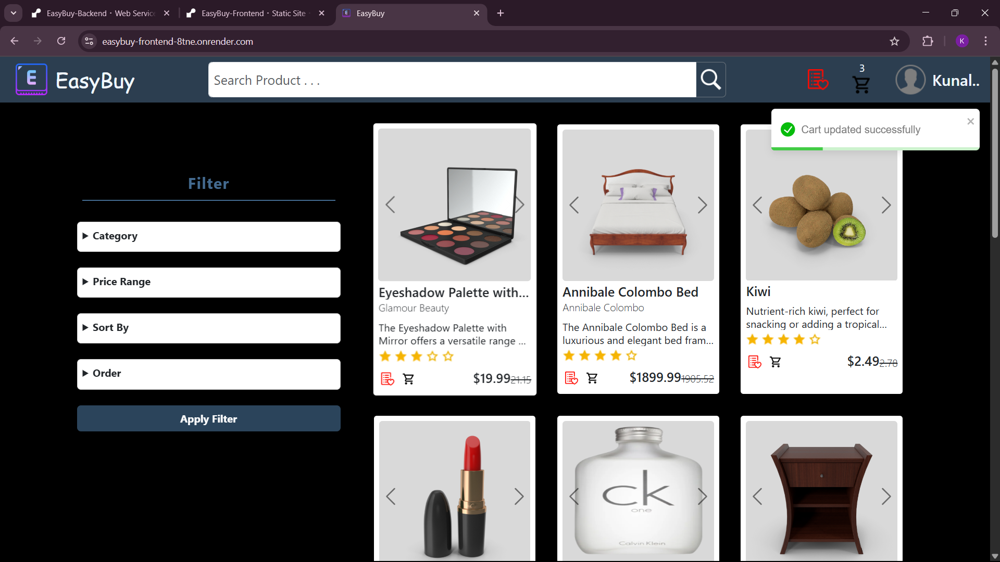
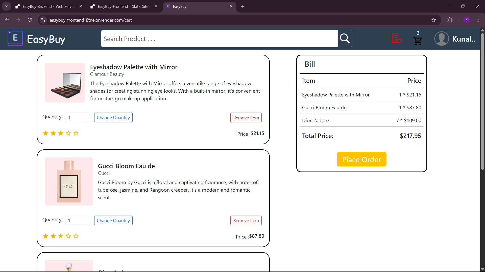

# EasyBuy

> A full-stack, mobile-responsive e-commerce web application built with React, Bootstrap, Express, MongoDB, and Passport.js.

---

## 🚀 Live Demo

[Try EasyBuy now!](https://easybuy-frontend-8tne.onrender.com)

## 📂 Repository

```bash
https://github.com/KunalVChoudhary/EasyBuy
```

---

## 📝 Table of Contents

1. [Features](#Features)
2. [Tech Stack](#tech-stack)
3. [Authentication](#authentication)
4. [Getting Started](#getting-started)
5. [Folder Structure](#folder-structure)
6. [API & Routes](#api--routes)
7. [To-Do / Upcoming Features](#to-do--upcoming-features)
8. [Screenshots / Preview](#screenshots--preview)
9. [License](#license)

---

## 🌟 Features

* **User Authentication**

  * Google OAuth and traditional email/password (session-based)
* **Product Browsing**

  * Responsive product listing with search and filter
  * Detailed product pages
* **Cart Management**

  * Add/remove items, adjust quantity
* **Wishlist**

  * Add/remove items (quantity control reserved for cart)
* **Reviews**

  * Backend routes implemented (frontend integration planned)
* **Mobile Responsive**

---

## 💻 Tech Stack

### Frontend

* **Framework**: React 18
* **UI**: Bootstrap v5, SASS
* **State Management**: Redux Toolkit
* **Router**: react-router-dom v7
* **Utilities**: react-slider, react-toastify
* **Build Tool**: Vite + `@vitejs/plugin-react`
* **Linting**: ESLint + `@eslint/js`, `eslint-plugin-react-hooks`

### Backend

* **Runtime**: Node.js + Express
* **Database**: MongoDB (Mongoose)
* **Authentication**: Passport.js (Google & Local strategy)
* **Session Store**: express-session + connect-mongo
* **Security / Utilities**: bcrypt, cors, dotenv, cookie-parser
* **Dev Tools**: nodemon, concurrently

---

## 🔐 Authentication

* **Strategies**: Google OAuth2.0 & Local (username + password)
* **Session-Based**: Uses cookies & express-session
* **Session Store**: Persists sessions in MongoDB

---

## 🛠 Getting Started

### Prerequisites

* Node.js v16+ and npm
* MongoDB instance (local or Atlas)

### Installation

1. **Clone the repo**

   ```bash
   git clone https://github.com/KunalVChoudhary/EasyBuy.git
   cd EasyBuy
   ```

2. **Install dependencies**

   ```bash
   npm install             # installs root-level concurrently
   cd frontend && npm install
   cd ../backend && npm install
   ```

3. **Configure environment**

   * Copy `.env.example` to `.env` in `/backend`

     * Set `PORT`, `MONGO_URL`, `SESSION_SECRET`, `GOOGLE_CLIENT_ID`, `GOOGLE_CLIENT_SECRET`, `GOOGLE_CALLBACK_URL`, `SESSION_SECRET`, `COOKIE_SECRET`  and `CLIENT_URL`
   * Copy `.env.example` to `.env` in `/frontend`

     * Set the base `VITE_API_URL` to point to your backend

4. **Run in development**

   ```bash
   npm start
   ```

   This uses `concurrently` to start both client and server.

---

## 📁 Folder Structure

```
EasyBuy/
├── frontend/          # React frontend (Vite)
│   ├── public/
│   │   └── images/
│   ├── src/
│   │   ├── components/
│   │   ├── redux/
│   │   ├── App.css
│   │   ├── App.jsx
│   │   ├── index.css
│   │   └── Main.jsx
│   ├── .env.example
│   ├── eslint.config.js
│   ├── index.html
│   ├── vite.config.js
│   ├── package-lock.json
│   └── package.json
├── backend/           # Express backend
│   ├── data/
│   ├── models/
│   ├── routes/
│   ├── strategies/
│   ├── package-lock.json
│   ├── package.json
│   └── server.js
├── package-lock.json 
└── package.json       # uses concurrently to run both
```

---

## 🔗 API & Routes

| Method | Route                   | Description                        |
| ------ | ----------------------- | ---------------------------------- |
| POST   | `/auth/signup`          | Local signup                       |
| POST   | `/auth/login`           | Local login                        |
| GET    | `/auth/google`          | Google OAuth redirect              |
| GET    | `/auth/google/callback` | Google OAuth callback              |
| GET    | `/signout`              | Log Out                            |
| GET    | `/products`             | List all products (with filter)    |
| GET    | `/products/:id`         | Get product details                |
| GET    | `/cart`                 | Get items in cart                  |
| POST   | `/cart`                 | Add item to cart                   |
| PATCH  | `/cart/:itemId`         | Update cart item quantity          |
| DELETE | `/cart/:itemId`         | Remove item from cart              |
| GET    | `/wishlist`             | Get items in wishlist              |
| POST   | `/wishlist`             | Add item to wishlist               |
| DELETE | `/wishlist/:itemId`     | Remove item from wishlist          |
| GET    | `/reviews`              | Get product reviews (backend only) |
| POST   | `/reviews`              | Create a review (backend only)     |
| PATCH  | `/reviews`              | Update a review (backend only)     |
| DELETE | `/reviews`              | Delete a review (backend only)     |

---

## 📋 To-Do / Upcoming Features

* Frontend integration of **Reviews**
* **Payment Gateway** integration
* User **order history** & **checkout** flow
* Admin dashboard for **product management**
* Unit & integration **tests**

---

## 📸 Screenshots / Preview

> 
> 


---

## ⚖️ License

Distributed under the MIT License. See [LICENSE](LICENSE) for more information.

---

## ✍️ Author

**Kunal Vijay Choudhary**
Final-year CSE Student & Full-Stack Developer

* GitHub: [@KunalVChoudhary](https://github.com/KunalVChoudhary)
* Email: [imkunalvchoudhary@gmail.com](mailto:imkunalvchoudhary@gmail.com)
* LinkedIn: [kunal-vijayshree-choudhary](https://www.linkedin.com/in/kunal-vijayshree-choudhary)

---

*Thank U!*
